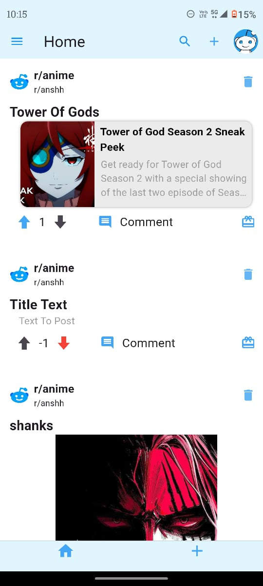
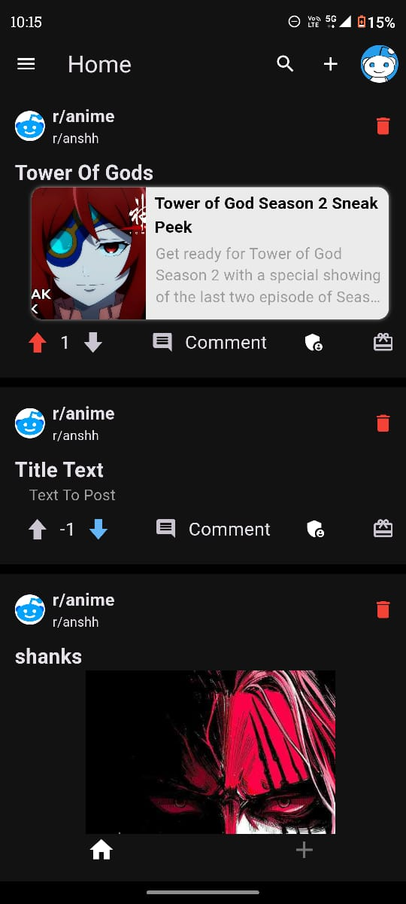
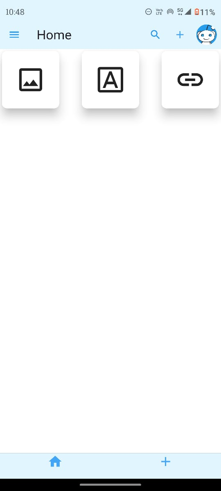
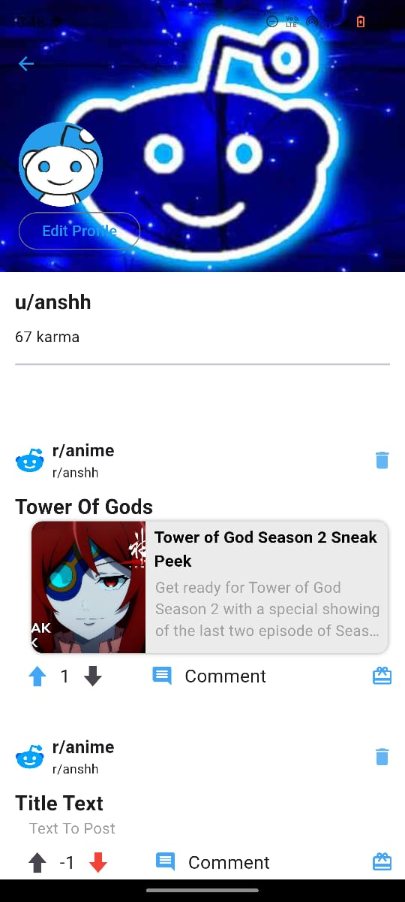

# Bludit

Bludit is a Reddit clone with a sleek blue theme and a normal dark theme like Reddit. It offers various features to provide a comprehensive social community experience.

## Features

- **Community Management**
  - Create and join communities.
  - Upload links, text, and images in communities.
  - Comment on posts within communities.
  - Send awards to other users.

- **User and Community Customization**
  - Change profile pictures and banners for both users and communities.

- **Authentication**
  - Google authentication through Firebase.
  - Guest authentication through Firebase.

## Installation

1. **Clone the repository:**

   ```bash
   git clone https://github.com/yourusername/bludit.git
   cd bludit

2. **Install dependencies:**
   -flutter pub get


3. **Run the app:**
   -flutter run


## Screenshots

| Community Profile | Feed | Dark Feed | Login Screen |
|-------------------|------|-----------|--------------|
|  |  |  |  |

| Post Image | Post Link | Post Options | Post Text |
|------------|-----------|--------------|-----------|
|  |  |  |  |

| User Profile |
|--------------|
|  |

